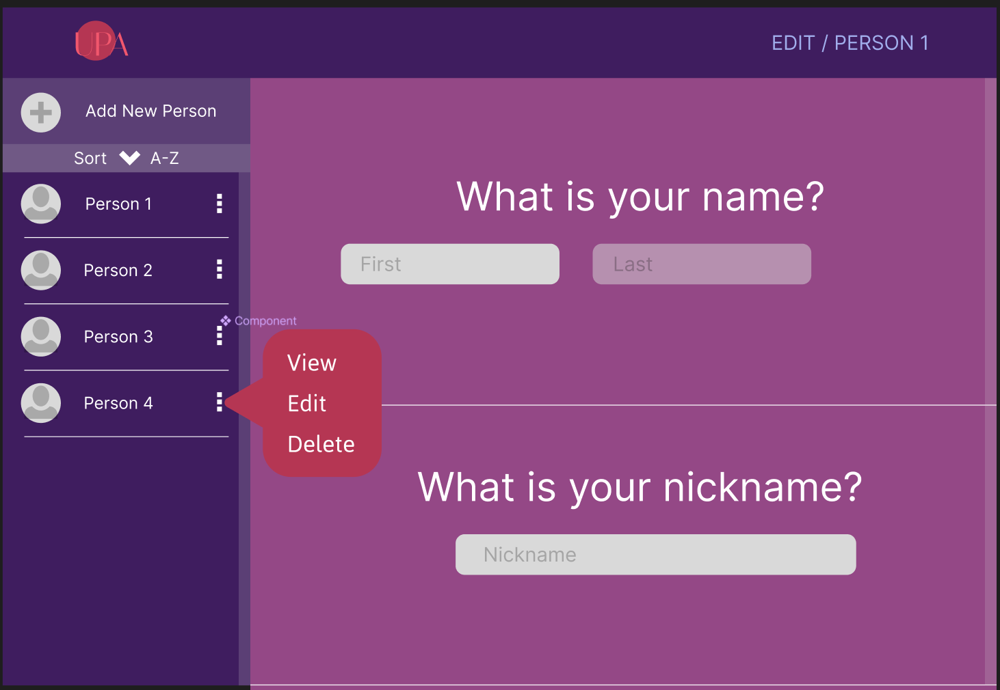
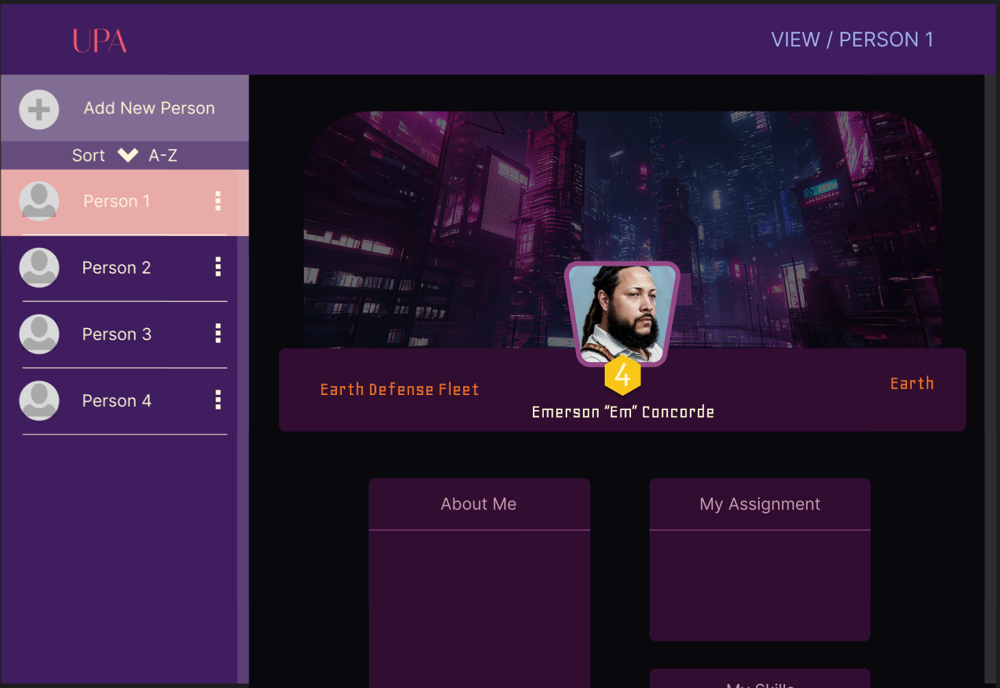

# UPA Profile Generator

## Overview

The UPA Profile Generator is a dynamic web application designed to streamline the creation and management of profiles for members of the Universal Protection Alliance (UPA). Inspired by state-of-the-art UI/UX designs found on platforms like Dribbble and godly.website, this project commenced with a sketch, evolved through a detailed Figma design, and was brought to life with HTML, CSS, and JavaScript. 

The application offers a seamless user experience for creating, viewing, and managing profiles, incorporating advanced features such as custom calendar input, skill selection, and real-time form validation. This project not only showcases proficiency in DOM manipulation and event-driven programming but also emphasizes the importance of user-centric design.

## Features

- **Dynamic Profile Creation**: Users can input personal information, select skills from a dropdown, and choose their birth date from a custom-built calendar.
- **Live Form Validation**: Ensures data integrity with immediate feedback on user input, utilizing HTML validation attributes and JavaScript.
- **Interactive UI**: Toggle between editing and viewing profiles with ease, thanks to an intuitive navigation system.
- **LocalStorage Integration**: Profiles are saved locally, allowing for persistent data management without the need for a backend database.

## Technical Stack

- **HTML5**: For structuring the content.
- **CSS3**: For styling, ensuring the application is visually appealing and responsive.
- **JavaScript**: For adding interactivity, handling events, and manipulating the DOM and BOM.

## Development Process

1. **Inspiration and Sketching**: Initial concepts were inspired by modern web designs and sketched out to define the layout and functionality.
2. **Design with Figma**: A high-fidelity prototype was created in Figma, detailing the visual elements and user flow.

3. **HTML Structure**: The application’s structure was built with semantic HTML, focusing on accessibility and SEO.
4. **Styling with CSS**: Custom styles were applied for a polished look, alongside responsive design principles to ensure usability across devices.
5. **JavaScript Implementation**: Core functionalities, including dynamic content generation and form validation, were developed with vanilla JavaScript.
6. **Testing and Refinement**: The application underwent rigorous testing to iron out bugs and enhance user experience.

## Getting Started

To explore the UPA Profile Generator:

1. Clone the repository to your local machine.
2. Open `index.html` in your browser to launch the application.
3. Start by adding a new person or select an existing profile to edit.

## Future Enhancements

- **Cloud Integration**: Implementing cloud storage for profiles to allow access across multiple devices.
- **User Authentication**: Adding login functionality to personalize user experience and secure data.
- **Advanced Sorting**: Enhancing the sorting feature to include more criteria and improve usability.

## Acknowledgments

This project was made possible by the creative community online, providing endless inspiration and resources. Special thanks to the free content resources that helped populate the initial content of the application.
